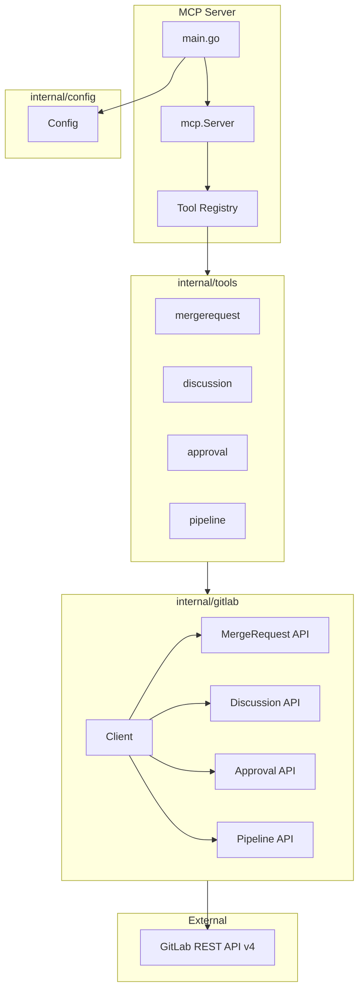
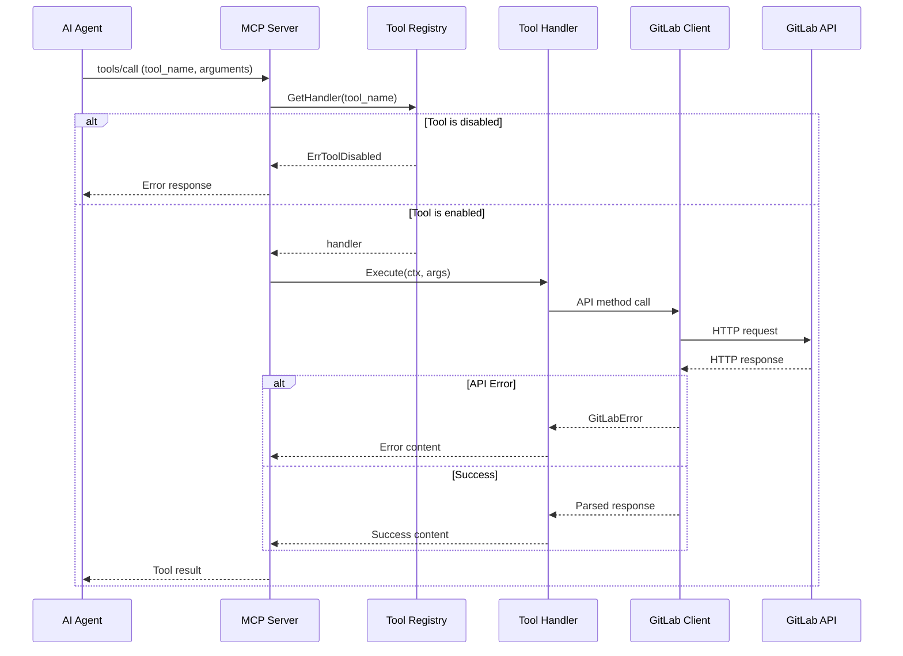
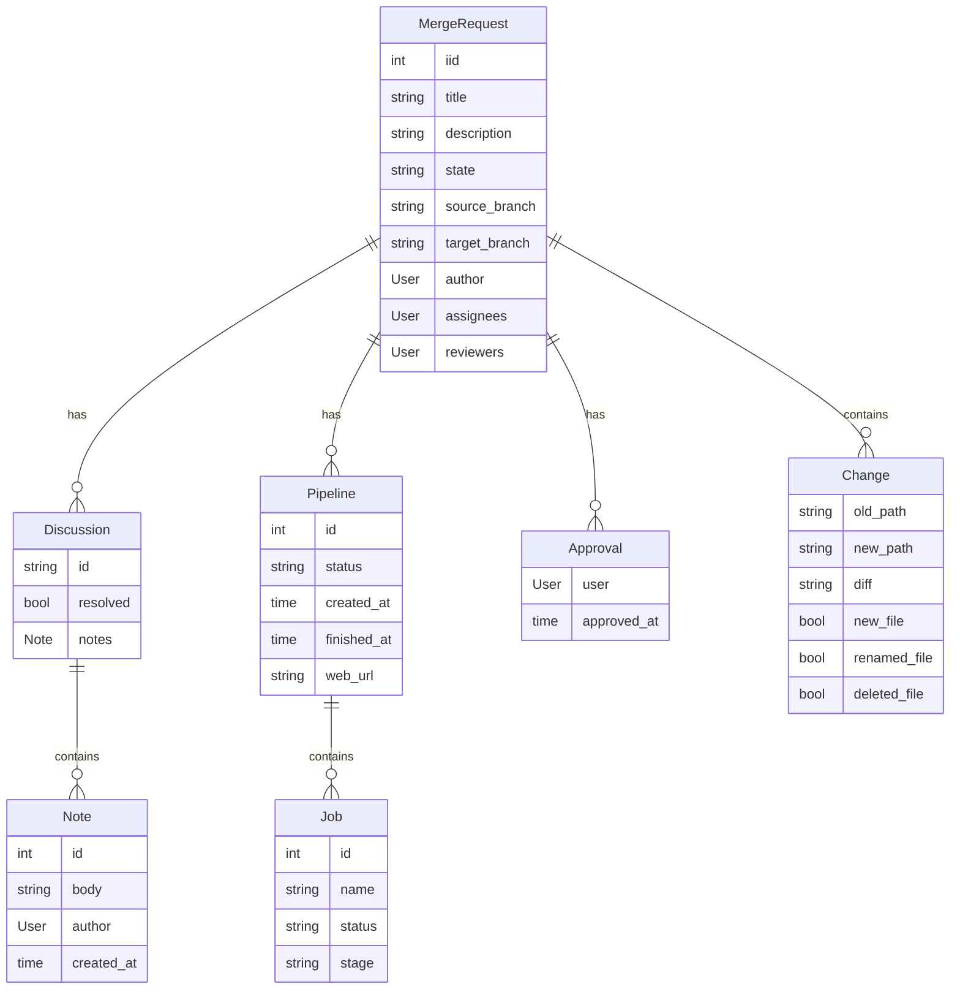

# Technical Design: GitLab MR MCP Server

## Overview

**Purpose**: GitLab の Merge Request 操作を AI エージェントが実行できるようにする MCP (Model Context Protocol) サーバーを提供する。

**Users**: AI エージェント（Claude Code など）が MR のレビュー、承認、マージなどのワークフローを自動化するために利用する。

**Impact**: GitLab REST API を MCP ツールとしてラップし、AI エージェントが自然言語指示から MR 操作を実行可能にする。

### Goals
- GitLab MR 操作の完全な MCP ツールセットを提供
- Go による型安全で高性能な実装
- 環境変数によるツール有効化/無効化の柔軟な制御
- セキュアな認証情報管理

### Non-Goals
- GitLab の MR 以外の機能（Issues, CI/CD 設定など）のサポート
- 複数 GitLab インスタンスの同時接続
- OAuth2 フローの実装（PAT のみサポート）

## Architecture

### Architecture Pattern & Boundary Map



**Architecture Integration**:
- **Selected pattern**: Package-based Modular — Go 標準のパッケージ構造で機能を分離
- **Domain boundaries**: Tools 層がユーザーインターフェース、GitLab 層が外部 API 抽象化
- **New components rationale**: 各ツールを独立パッケージとして実装し、有効化/無効化を容易に

### Technology Stack

| Layer | Choice / Version | Role in Feature | Notes |
|-------|------------------|-----------------|-------|
| Language | Go 1.25.5 | 実装言語 | 最新安定版 |
| MCP SDK | github.com/modelcontextprotocol/go-sdk v1.2.0+ | MCP プロトコル実装 | 公式 SDK |
| GitLab SDK | gitlab.com/gitlab-org/api/client-go v1.0+ | GitLab API 通信 | 公式 SDK |
| Transport | stdio | MCP 通信 | CLI 連携用 |
| Testing | testing + testify | テスト | モック生成含む |

## System Flows

### MCP ツール呼び出しフロー



## Requirements Traceability

| Requirement | Summary | Components | Interfaces | Flows |
|-------------|---------|------------|------------|-------|
| 1.1-1.4 | GitLab 認証・接続 | config.Config, gitlab.Client | Config | - |
| 2.1-2.5 | MR 一覧取得 | tools/mergerequest | ListMergeRequestsParams | ツール呼び出し |
| 3.1-3.4 | MR 詳細取得 | tools/mergerequest | GetMergeRequestParams | ツール呼び出し |
| 4.1-4.5 | MR 作成 | tools/mergerequest | CreateMergeRequestParams | ツール呼び出し |
| 5.1-5.4 | MR 更新 | tools/mergerequest | UpdateMergeRequestParams | ツール呼び出し |
| 6.1-6.5 | コメント・ディスカッション | tools/discussion | DiscussionParams | ツール呼び出し |
| 7.1-7.4 | MR 承認 | tools/approval | ApprovalParams | ツール呼び出し |
| 8.1-8.5 | MR マージ | tools/mergerequest | MergeParams | ツール呼び出し |
| 9.1-9.3 | 変更差分取得 | tools/mergerequest | GetChangesParams | ツール呼び出し |
| 10.1-10.3 | パイプライン情報 | tools/pipeline | PipelineParams | ツール呼び出し |
| 11.1-11.5 | MCP サーバー基盤 | mcp.Server, registry | MCP Protocol | - |
| 12.1-12.4 | エラーハンドリング | gitlab.Client | Error types | - |
| 13.1-13.6 | ツール有効化/無効化 | config.Config, registry | ToolConfig | - |
| 14.1-14.8 | ドキュメント | README.md, docs/ | - | - |

## Components and Interfaces

| Component | Domain/Layer | Intent | Req Coverage | Key Dependencies | Contracts |
|-----------|--------------|--------|--------------|------------------|-----------|
| config.Config | Config | 環境変数から設定を読み込み管理 | 1.1, 13.1-13.6 | os.Getenv (P0) | Service |
| gitlab.Client | API Client | GitLab Go SDK のラッパー | 1.2-1.4, 12.1-12.3 | config.Config (P0), gitlab-sdk (P0) | Service |
| registry.Registry | Core | ツールの登録と有効/無効管理 | 11.3-11.4, 13.4-13.5 | config.Config (P0) | Service |
| tools/mergerequest | Tools | MR 操作ツール群 | 2-5, 8-9 | gitlab.Client (P0) | Service |
| tools/discussion | Tools | ディスカッション操作ツール群 | 6.1-6.5 | gitlab.Client (P0) | Service |
| tools/approval | Tools | 承認操作ツール群 | 7.1-7.4 | gitlab.Client (P0) | Service |
| tools/pipeline | Tools | パイプライン情報ツール群 | 10.1-10.3 | gitlab.Client (P0) | Service |

### Config Layer

#### config.Config

| Field | Detail |
|-------|--------|
| Intent | 環境変数から GitLab 接続情報とツール設定を読み込む |
| Requirements | 1.1, 13.1-13.6 |

**Responsibilities & Constraints**
- 環境変数のパースと検証
- ツール有効化/無効化リストの管理
- DISABLED_TOOLS 優先ルールの適用

**Dependencies**
- External: os.Getenv — 環境変数 (P0)

**Contracts**: Service [x]

##### Service Interface
```go
package config

// Config はアプリケーション設定を保持する
type Config struct {
    GitLabURL     string
    GitLabToken   string
    EnabledTools  []string // nil = all enabled
    DisabledTools []string
    Debug         bool
}

// Load は環境変数から設定を読み込む
func Load() (*Config, error)

// IsToolEnabled はツールが有効かどうかを判定する
// DISABLED_TOOLS が ENABLED_TOOLS より優先される
func (c *Config) IsToolEnabled(toolName string) bool
```
- Preconditions: GITLAB_URL, GITLAB_TOKEN が設定されている
- Postconditions: 有効な Config を返す、または error
- Invariants: GitLabToken はログに出力されない

### API Client Layer

#### gitlab.Client

| Field | Detail |
|-------|--------|
| Intent | GitLab Go SDK をラップし、MCP ツールに必要なインターフェースを提供 |
| Requirements | 1.2-1.4, 12.1-12.3 |

**Responsibilities & Constraints**
- GitLab Go SDK クライアントの初期化と管理
- SDK のエラーを MCP 互換形式に変換
- レート制限エラーの検出と通知

**Dependencies**
- Inbound: Tools — API 操作の実行 (P0)
- External: gitlab.com/gitlab-org/api/client-go — GitLab Go SDK (P0)

**Contracts**: Service [x]

##### Service Interface
```go
package gitlab

import (
    gogitlab "gitlab.com/gitlab-org/api/client-go"
)

// Client は GitLab API クライアントのラッパー
type Client struct {
    client *gogitlab.Client
}

// NewClient は新しい GitLab クライアントを作成する
func NewClient(baseURL, token string) (*Client, error)

// SDK の各サービスへのアクセサ
func (c *Client) MergeRequests() *gogitlab.MergeRequestsService
func (c *Client) Discussions() *gogitlab.DiscussionsService
func (c *Client) MergeRequestApprovals() *gogitlab.MergeRequestApprovalsService
func (c *Client) Pipelines() *gogitlab.PipelinesService
func (c *Client) Jobs() *gogitlab.JobsService
func (c *Client) Notes() *gogitlab.NotesService
```
- Preconditions: 有効なトークンと URL で初期化されている
- Postconditions: 設定済みの SDK クライアントを返す
- Invariants: 認証トークンは SDK 内部で管理

**Implementation Notes**
- Integration: GitLab Go SDK を使用、SDK のデフォルト設定を活用
- Validation: SDK がエラーハンドリングを実施、追加のラッピングで MCP 形式に変換
- Risks: SDK のバージョン変更時の互換性確認

### Tools Layer

#### tools/mergerequest

| Field | Detail |
|-------|--------|
| Intent | MR の CRUD 操作とマージを MCP ツールとして提供 |
| Requirements | 2.1-2.5, 3.1-3.4, 4.1-4.5, 5.1-5.4, 8.1-8.5, 9.1-9.3 |

**Contracts**: Service [x]

##### Service Interface
```go
package mergerequest

// ListMergeRequestsParams は list_merge_requests の入力パラメータ
type ListMergeRequestsParams struct {
    ProjectID  string  `json:"project_id" jsonschema:"required,description=プロジェクト ID または URL エンコードされたパス"`
    State      *string `json:"state,omitempty" jsonschema:"enum=opened,enum=closed,enum=merged,enum=all,description=MR の状態"`
    AuthorID   *int    `json:"author_id,omitempty" jsonschema:"description=作成者のユーザー ID"`
    AssigneeID *int    `json:"assignee_id,omitempty" jsonschema:"description=アサイン先のユーザー ID"`
}

// GetMergeRequestParams は get_merge_request の入力パラメータ
type GetMergeRequestParams struct {
    ProjectID      string `json:"project_id" jsonschema:"required,description=プロジェクト ID"`
    MergeRequestIID int   `json:"merge_request_iid" jsonschema:"required,description=MR の IID"`
    IncludeChanges *bool  `json:"include_changes,omitempty" jsonschema:"description=変更差分を含めるか"`
}

// CreateMergeRequestParams は create_merge_request の入力パラメータ
type CreateMergeRequestParams struct {
    ProjectID    string   `json:"project_id" jsonschema:"required,description=プロジェクト ID"`
    SourceBranch string   `json:"source_branch" jsonschema:"required,description=ソースブランチ"`
    TargetBranch string   `json:"target_branch" jsonschema:"required,description=ターゲットブランチ"`
    Title        string   `json:"title" jsonschema:"required,description=MR タイトル"`
    Description  *string  `json:"description,omitempty" jsonschema:"description=MR 説明"`
    AssigneeIDs  []int    `json:"assignee_ids,omitempty" jsonschema:"description=アサイン先ユーザー ID"`
    ReviewerIDs  []int    `json:"reviewer_ids,omitempty" jsonschema:"description=レビュアーユーザー ID"`
    Labels       []string `json:"labels,omitempty" jsonschema:"description=ラベル"`
}

// UpdateMergeRequestParams は update_merge_request の入力パラメータ
type UpdateMergeRequestParams struct {
    ProjectID       string   `json:"project_id" jsonschema:"required,description=プロジェクト ID"`
    MergeRequestIID int      `json:"merge_request_iid" jsonschema:"required,description=MR の IID"`
    Title           *string  `json:"title,omitempty" jsonschema:"description=新しいタイトル"`
    Description     *string  `json:"description,omitempty" jsonschema:"description=新しい説明"`
    AssigneeIDs     []int    `json:"assignee_ids,omitempty" jsonschema:"description=新しいアサイン先"`
    ReviewerIDs     []int    `json:"reviewer_ids,omitempty" jsonschema:"description=新しいレビュアー"`
    Labels          []string `json:"labels,omitempty" jsonschema:"description=新しいラベル"`
    TargetBranch    *string  `json:"target_branch,omitempty" jsonschema:"description=新しいターゲットブランチ"`
}

// MergeMergeRequestParams は merge_merge_request の入力パラメータ
type MergeMergeRequestParams struct {
    ProjectID                string `json:"project_id" jsonschema:"required,description=プロジェクト ID"`
    MergeRequestIID          int    `json:"merge_request_iid" jsonschema:"required,description=MR の IID"`
    Squash                   *bool  `json:"squash,omitempty" jsonschema:"description=コミットを squash するか"`
    ShouldRemoveSourceBranch *bool  `json:"should_remove_source_branch,omitempty" jsonschema:"description=ソースブランチを削除するか"`
}

// GetMergeRequestChangesParams は get_merge_request_changes の入力パラメータ
type GetMergeRequestChangesParams struct {
    ProjectID       string `json:"project_id" jsonschema:"required,description=プロジェクト ID"`
    MergeRequestIID int    `json:"merge_request_iid" jsonschema:"required,description=MR の IID"`
}

// Register は MR 関連ツールを登録する
func Register(server *mcp.Server, client *gitlab.Client, cfg *config.Config)
```

#### tools/discussion

| Field | Detail |
|-------|--------|
| Intent | MR のコメントとディスカッション操作を MCP ツールとして提供 |
| Requirements | 6.1-6.5 |

**Contracts**: Service [x]

##### Service Interface
```go
package discussion

// AddCommentParams は add_merge_request_comment の入力パラメータ
type AddCommentParams struct {
    ProjectID       string `json:"project_id" jsonschema:"required,description=プロジェクト ID"`
    MergeRequestIID int    `json:"merge_request_iid" jsonschema:"required,description=MR の IID"`
    Body            string `json:"body" jsonschema:"required,description=コメント本文"`
}

// AddDiscussionParams は add_merge_request_discussion の入力パラメータ
type AddDiscussionParams struct {
    ProjectID       string        `json:"project_id" jsonschema:"required,description=プロジェクト ID"`
    MergeRequestIID int           `json:"merge_request_iid" jsonschema:"required,description=MR の IID"`
    Body            string        `json:"body" jsonschema:"required,description=ディスカッション本文"`
    Position        *DiffPosition `json:"position,omitempty" jsonschema:"description=差分位置（特定行へのコメント用）"`
}

// DiffPosition は差分内の位置を指定する
type DiffPosition struct {
    BaseSHA  string `json:"base_sha" jsonschema:"required,description=ベース SHA"`
    StartSHA string `json:"start_sha" jsonschema:"required,description=開始 SHA"`
    HeadSHA  string `json:"head_sha" jsonschema:"required,description=HEAD SHA"`
    OldPath  string `json:"old_path" jsonschema:"required,description=変更前ファイルパス"`
    NewPath  string `json:"new_path" jsonschema:"required,description=変更後ファイルパス"`
    OldLine  *int   `json:"old_line,omitempty" jsonschema:"description=変更前行番号"`
    NewLine  *int   `json:"new_line,omitempty" jsonschema:"description=変更後行番号"`
}

// ListDiscussionsParams は list_merge_request_discussions の入力パラメータ
type ListDiscussionsParams struct {
    ProjectID       string `json:"project_id" jsonschema:"required,description=プロジェクト ID"`
    MergeRequestIID int    `json:"merge_request_iid" jsonschema:"required,description=MR の IID"`
}

// ResolveDiscussionParams は resolve_discussion の入力パラメータ
type ResolveDiscussionParams struct {
    ProjectID       string `json:"project_id" jsonschema:"required,description=プロジェクト ID"`
    MergeRequestIID int    `json:"merge_request_iid" jsonschema:"required,description=MR の IID"`
    DiscussionID    string `json:"discussion_id" jsonschema:"required,description=ディスカッション ID"`
    Resolved        bool   `json:"resolved" jsonschema:"required,description=解決済みにするか"`
}

// Register はディスカッション関連ツールを登録する
func Register(server *mcp.Server, client *gitlab.Client, cfg *config.Config)
```

#### tools/approval

| Field | Detail |
|-------|--------|
| Intent | MR の承認操作を MCP ツールとして提供 |
| Requirements | 7.1-7.4 |

**Contracts**: Service [x]

##### Service Interface
```go
package approval

// ApproveParams は approve_merge_request の入力パラメータ
type ApproveParams struct {
    ProjectID       string `json:"project_id" jsonschema:"required,description=プロジェクト ID"`
    MergeRequestIID int    `json:"merge_request_iid" jsonschema:"required,description=MR の IID"`
}

// UnapproveParams は unapprove_merge_request の入力パラメータ
type UnapproveParams struct {
    ProjectID       string `json:"project_id" jsonschema:"required,description=プロジェクト ID"`
    MergeRequestIID int    `json:"merge_request_iid" jsonschema:"required,description=MR の IID"`
}

// GetApprovalsParams は get_merge_request_approvals の入力パラメータ
type GetApprovalsParams struct {
    ProjectID       string `json:"project_id" jsonschema:"required,description=プロジェクト ID"`
    MergeRequestIID int    `json:"merge_request_iid" jsonschema:"required,description=MR の IID"`
}

// Register は承認関連ツールを登録する
func Register(server *mcp.Server, client *gitlab.Client, cfg *config.Config)
```

#### tools/pipeline

| Field | Detail |
|-------|--------|
| Intent | MR 関連パイプライン情報を MCP ツールとして提供 |
| Requirements | 10.1-10.3 |

**Contracts**: Service [x]

##### Service Interface
```go
package pipeline

// ListPipelinesParams は list_merge_request_pipelines の入力パラメータ
type ListPipelinesParams struct {
    ProjectID       string `json:"project_id" jsonschema:"required,description=プロジェクト ID"`
    MergeRequestIID int    `json:"merge_request_iid" jsonschema:"required,description=MR の IID"`
}

// GetPipelineJobsParams は get_pipeline_jobs の入力パラメータ
type GetPipelineJobsParams struct {
    ProjectID  string `json:"project_id" jsonschema:"required,description=プロジェクト ID"`
    PipelineID int    `json:"pipeline_id" jsonschema:"required,description=パイプライン ID"`
}

// Register はパイプライン関連ツールを登録する
func Register(server *mcp.Server, client *gitlab.Client, cfg *config.Config)
```

## Data Models

### Domain Model



### API Data Types

GitLab Go SDK が提供する型をそのまま使用する。主要な型は以下の通り:

```go
import gogitlab "gitlab.com/gitlab-org/api/client-go"

// SDK 提供の主要な型（自前定義不要）
// - gogitlab.MergeRequest      MR 情報
// - gogitlab.BasicUser         ユーザー情報
// - gogitlab.Discussion        ディスカッション
// - gogitlab.Note              コメント/ノート
// - gogitlab.Pipeline          パイプライン
// - gogitlab.Job               ジョブ
// - gogitlab.MergeRequestDiff  変更差分
// - gogitlab.MergeRequestApprovals 承認状態
```

**Note**: SDK の型を直接使用することで、型定義の重複を避け、SDK のアップデートに自動追従できる。

## Error Handling

### Error Strategy

GitLab Go SDK のエラーを MCP プロトコルに準拠した形式に変換して返却する。

### Error Types

```go
package errors

import (
    "fmt"
    "net/http"

    gogitlab "gitlab.com/gitlab-org/api/client-go"
)

// ErrorCode はエラーコード
type ErrorCode string

const (
    ErrCodeUnauthorized    ErrorCode = "unauthorized"
    ErrCodeForbidden       ErrorCode = "forbidden"
    ErrCodeNotFound        ErrorCode = "not_found"
    ErrCodeRateLimited     ErrorCode = "rate_limited"
    ErrCodeBadRequest      ErrorCode = "bad_request"
    ErrCodeServerError     ErrorCode = "server_error"
    ErrCodeToolDisabled    ErrorCode = "tool_disabled"
)

// MCPError は MCP 互換エラー
type MCPError struct {
    Code    ErrorCode
    Message string
}

// FromGitLabError は GitLab SDK エラーを MCP エラーに変換
func FromGitLabError(err error, resp *gogitlab.Response) *MCPError
```

### Error Categories and Responses

**SDK エラーの変換**:
GitLab Go SDK は `*gogitlab.Response` でステータスコードを返すため、これを元に分類。

**User Errors (4xx)**:
- 400 Bad Request → 入力パラメータの検証エラー詳細を返却
- 401 Unauthorized → 「認証トークンが無効または期限切れです」
- 403 Forbidden → 「この操作を実行する権限がありません」
- 404 Not Found → 「指定されたリソースが見つかりません」

**System Errors (5xx)**:
- 500 Internal Server Error → 「GitLab サーバーでエラーが発生しました」
- 502/503/504 → 「GitLab サーバーに接続できません。しばらく待ってから再試行してください」

**Rate Limiting (429)**:
- 「API レート制限に達しました。しばらく待ってから再試行してください」

**Tool Disabled Error**:
- 「このツール ({toolName}) は無効化されています」

## Testing Strategy

### Unit Tests
- config: 環境変数パース、ツール有効化ロジック
- gitlab.Client: SDK クライアント初期化のテスト
- registry: ツール登録、有効/無効判定
- 各ツールパッケージ: 入力検証、出力フォーマット
- errors: SDK エラーから MCP エラーへの変換

### Integration Tests
- GitLab Go SDK のモック機能を使用したテスト
- エラーケース（認証失敗、404、429）の処理確認
- ツール有効化/無効化の動作確認

### E2E Tests (Manual)
- 実際の GitLab インスタンスを使用した動作確認
- Claude Code との連携テスト

## Security Considerations

- **認証トークン管理**: 環境変数でのみ設定、ログ出力時はマスキング
- **入力検証**: struct タグと jsonschema による厳格な検証
- **最小権限**: 必要な GitLab スコープのみ要求（api または read_api + write_repository）

## Project Structure

```
gitlab-mcp/
├── cmd/
│   └── gitlab-mcp/
│       └── main.go           # エントリーポイント
├── internal/
│   ├── config/
│   │   ├── config.go         # 設定管理
│   │   └── config_test.go
│   ├── gitlab/
│   │   ├── client.go         # GitLab API クライアント
│   │   ├── client_test.go
│   │   ├── types.go          # データ型定義
│   │   └── errors.go         # エラー型定義
│   ├── registry/
│   │   ├── registry.go       # ツールレジストリ
│   │   └── registry_test.go
│   └── tools/
│       ├── mergerequest/
│       │   ├── tools.go      # MR 操作ツール
│       │   └── tools_test.go
│       ├── discussion/
│       │   ├── tools.go      # ディスカッションツール
│       │   └── tools_test.go
│       ├── approval/
│       │   ├── tools.go      # 承認ツール
│       │   └── tools_test.go
│       └── pipeline/
│           ├── tools.go      # パイプラインツール
│           └── tools_test.go
├── docs/
│   └── README.ja.md          # 日本語ドキュメント
├── go.mod
├── go.sum
├── LICENSE
├── CONTRIBUTING.md
└── README.md                 # 英語ドキュメント（メイン）
```

## Documentation Structure

### README.md (English - Primary)

```markdown
# GitLab MCP Server

[]
[]
[]

> MCP server for GitLab Merge Request operations

## Features
## Quick Start (5 min setup)
## Installation
## Configuration
### Environment Variables
## Available Tools
## Usage Examples
### Claude Code
### Claude Desktop
## Contributing
## License
```

### docs/README.ja.md (Japanese)

README.md と同等の内容を日本語で提供。冒頭に英語版へのリンクを配置。
